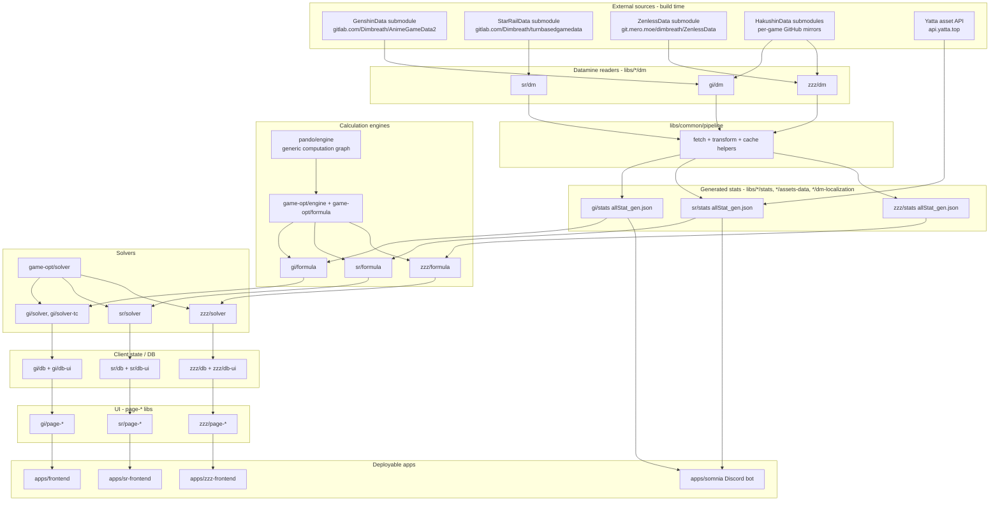

# Architecture

## High-level shape

There is **no server-side API** in this repository. Each game (GI/SR/ZZZ) gets its own vertical slice of libraries that all follow the same layered pattern, sharing a small set of cross-game "common" and "pando"/"game-opt" libraries. The three verticals are independent enough to evolve at different paces (GI still uses a legacy engine; SR and ZZZ use the newer Pando engine).



## Build-time vs. run-time

**Build time** (Nx `gen-file` target, chained via `dependsOn: ["load-dm", "^gen-file"]` in [nx.json](/nx.json)):
1. `load-dm` — the `@genshin-optimizer/common/plugin:sync-repo` executor pulls/updates the datamine git submodules under `libs/{gi,sr,zzz}/dm/*`.
2. Each `libs/*/dm` package parses the raw datamine JSON/Excel-config files into typed TS structures (e.g. `AvatarExcelConfigData`, `WeaponExcelConfigData`, `ReliquaryExcelConfigData`).
3. `libs/*/stats` executors (`gen-stats`) and `libs/*/assets-data`/`*/dm-localization` executors distill the raw datamine + Hakushin data into small, committed, generated JSON files (`allStat_gen.json`, asset manifests, locale strings) that ship in the final bundle — the datamine submodules themselves are never shipped to users.
4. `libs/*/i18n-node` and `dm-localization` extract translatable strings for i18next.

**Run time** (in the browser, or in the Somnia process):
1. `libs/*/db` holds the user's save data (owned characters, artifacts/relics/discs, weapons/light cones/W-engines, teams) using a common database abstraction from `libs/common/database`, persisted client-side (localStorage/IndexedDB) and exposed to React via `libs/*/db-ui` context/hooks.
2. `libs/*/formula` builds a computation graph (using `libs/pando/engine`, or the legacy `libs/gi/wr` engine for GI) that maps character/weapon/artifact stats → in-game combat formulas.
3. `libs/*/solver` (built on `libs/game-opt/solver` + `libs/game-opt/engine`) explores the space of owned artifacts/relics/discs to maximize a formula's output, subject to user constraints — this runs client-side, typically via Web Workers for the heavy search.
4. `libs/*/page-*` libraries are the lazy-loaded route-level React UI, wired to the DB and formula/solver layers, and mounted by each app's `App.tsx`.
5. `libs/*/*-scanner` libs (art-scanner for GI, disc-scanner for ZZZ) run tesseract.js OCR client-side to import gear from screenshots into the DB.

## Two calculation engines coexist

- **Legacy ("Waverider")**: `libs/gi/wr` + `libs/gi/wr-types` — the original GI-only calculation engine, still used by `apps/frontend`. Marked deprecated in the root README.
- **Pando**: `libs/pando/engine` — a generic, tag-based computation-graph engine (nodes, custom operations, range/monotonicity tracking for solver pruning) used by `libs/game-opt/*` and consumed by `gi/formula` (partially/being migrated), `sr/formula`, and `zzz/formula`. Star Rail and Zenless were built on Pando from day one; GI is the one game still mid-migration off Waverider.

## Layering rules (enforced by Nx module boundaries / project references)

```
consts, schema, util          →  no dependencies on other domain libs (leaf nodes)
dm, dm-localization           →  depend on consts/schema only; read raw datamine submodules
stats, assets-data            →  depend on dm + common/pipeline
formula                       →  depends on stats + pando/engine (or game-opt/formula)
db                            →  depends on schema/good(or srod/zood) + common/database
solver                        →  depends on formula + game-opt/solver + game-opt/engine
db-ui, formula-ui, page-*     →  depend on db/formula/solver + common/react-util + common/ui
apps/*                        →  compose page-* libs into routes; own build/serve config only
```

Each game domain (`gi`, `sr`, `zzz`) is architecturally parallel and does not depend on the other games' libs — cross-game sharing only happens through `common/*`, `game-opt/*`, and `pando/*`.

## Nx task graph

- `nx graph` renders the live dependency graph for every project (recommended over trying to keep a static diagram in sync).
- Caching is enabled for `gen-file`, `test`, `@nx/js:tsc`, `@nx/esbuild:esbuild`, and `@nx/vitest:test` targets (see [nx.json](/nx.json)), so CI/local runs only rebuild what's affected.
- `nx affected` (used by the `mini-ci` script) limits format/typecheck/lint/test to projects touched by a change, using `master` as the diff base.
