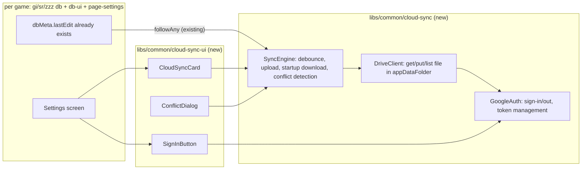
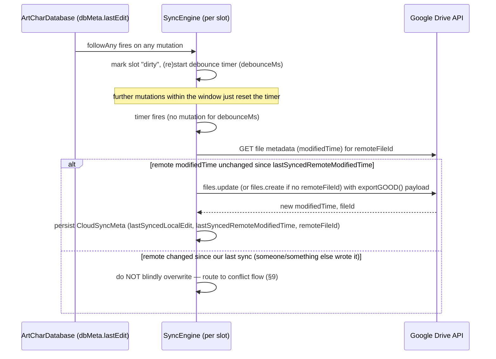
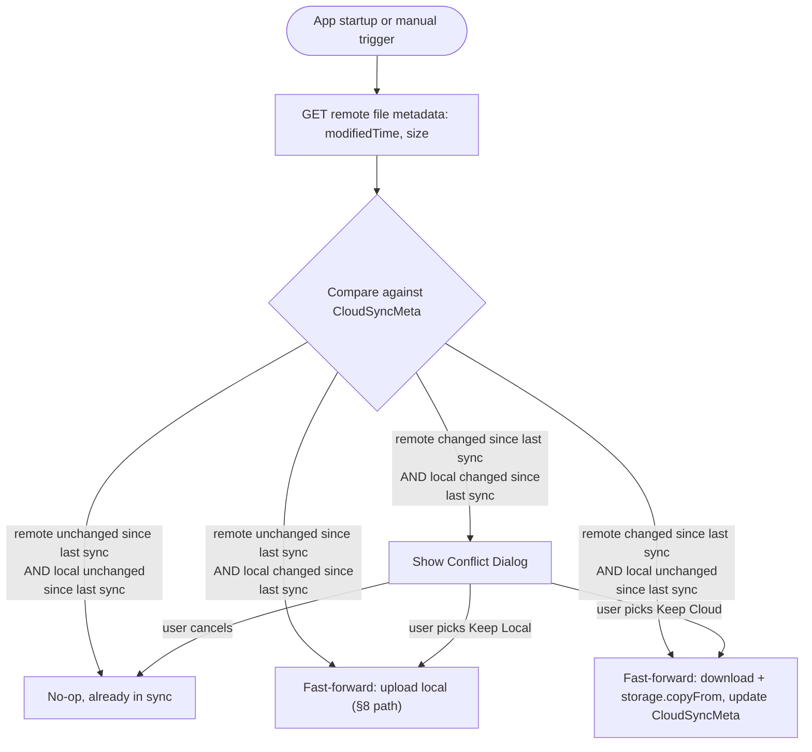

# Design: Cloud Sync (Google Drive)

**Status:** Implemented (GI, Phase 1). See §17 for implementation deviations from this draft.
**Author:** GitHub Copilot (drafted from repo analysis)
**Date:** 2026-08-29

## 1. Summary

Let users back up and sync their local save data (characters, artifacts/relics/discs, weapons/light cones/W-engines, teams, builds, settings) to their own Google Drive account, so it survives browser data clearing and can be carried between devices/browsers.

## 2. Requirements (from request)

1. User can sign in with Google Drive. A **Sign in** button is added to the Settings screen.
2. **Upload** runs automatically whenever local data changes, **debounced 15s** (must be configurable).
3. **Download** runs automatically on app startup, and can also be triggered manually via a button.
4. On conflict (local and cloud both changed independently), show a dialog letting the user pick which copy to keep, displaying metadata (last-modified time, size) for each side.

## 3. Relevant existing code (context this design builds on)

- **Storage abstraction**: [`DBStorage`](/libs/common/database/src/lib/DBStorage.ts) / [`DBLocalStorage`](/libs/common/database/src/lib/DBLocalStorage.ts) / `SandboxStorage` — a key/value string store backing every game's database. `copyFrom()` already implements "replace all local data from another storage", which a "restore from cloud" action can reuse directly.
- **Change tracking already exists**: [`ArtCharDatabase`](/libs/gi/db/src/Database/ArtCharDatabase.ts) wires `followAny(updateLastEdit)` on every `DataManager`/`DataEntry`, writing `dbMeta.set({ lastEdit: Date.now() })` on **any** mutation. SR/ZZZ have the equivalent. This is the exact hook point for "whenever data changes."
- **Serialization already exists**: `database.exportGOOD()` produces a complete, JSON-serializable snapshot of one local database (GOOD/SROD/ZOOD format depending on game). This is the natural sync payload — no new serialization format needed.
- **Multiple local save slots**: each app supports up to 4 independent local databases (`dbIndex: 1 | 2 | 3 | 4`), managed through `DatabaseContext` (see [`databases`, `database`, `setDatabase`](/libs/gi/ui/src/components/database/DatabaseCard.tsx)). Sync needs to account for this — it is **not** a single global save file per game. Per §16.2, cloud sync only ever operates on whichever slot is currently active (`database`/`dbIndex`) — see §4/§8/§9.
- **Existing import/merge precedent**: [`UploadCard`](/libs/gi/ui/src/components/database/UploadCard.tsx) already lets a user import a GOOD JSON file into a sandboxed copy of the DB with merge options (`keepWepArtiNotInImport`, `keepCharNotInImport`, `ignoreDups`) before committing. The conflict dialog in this design is a lighter-weight sibling of that flow (whole-snapshot choice, not field-level merge — see §8 for why).
- **Settings screen composition**: each game's Settings page (e.g. [`libs/gi/page-settings/src/index.tsx`](/libs/gi/page-settings/src/index.tsx)) assembles cards like `<DatabaseCard />` from `libs/{gi,sr,zzz}/ui/src/components/database|Settings/DatabaseCard.tsx`. A new `<CloudSyncCard />` is added the same way, per app.
- **Three parallel game domains**: per [AGENTS.md](/AGENTS.md), `gi`/`sr`/`zzz` are architecturally parallel and must not cross-import. Since this feature is identical across all three, the sync **engine** must live in `common/*`, with each game only wiring it up to its own `ArtCharDatabase`-equivalent.

## 4. Scope / assumptions (resolved, see §16)

- **Apps in scope**: `frontend` (GI), `sr-frontend`, `zzz-frontend`. `somnia` (Discord bot) is out of scope — it has no concept of a signed-in user's Drive.
- **Sync granularity**: one Drive file **per local database slot per game** (so up to 4 possible files for GI, 4 for SR, 4 for ZZZ), not one combined file. **Only the currently active slot is synced at runtime** — the `SyncEngine` watches/uploads for whichever slot is active in `DatabaseContext` at any given moment, not all 4 simultaneously. Each slot's Drive file is created **lazily**, the first time that slot is active with sync enabled for it, rather than provisioning all 4 up front. This matches the existing local multi-slot model, keeps upload payloads small, and avoids needless Drive API calls for slots the user isn't currently using (confirmed, §16.2).
- **Conflict resolution granularity**: whole-snapshot ("keep local" vs "keep cloud"), not field-level merge. Field-level merge already exists for manual GOOD import (`UploadCard`) and can be offered later as "Advanced merge…" from the conflict dialog, but is out of scope for v1.
- **Storage location on Drive**: use the [`drive.file`](https://developers.google.com/drive/api/guides/api-specific-auth) OAuth scope (least-privilege — the app can only see files it created, not the user's whole Drive) with files created in the app's Drive **AppData folder** (`appDataFolder` special space) rather than a visible folder, so nothing shows up in the user's regular Drive UI and there's no risk of the user manually editing/corrupting the sync file. Trade-off: user can't casually browse the backup file in Drive; we mitigate this by keeping the existing manual "Download" (local file) button as the user-visible backup mechanism.
- These defaults are confirmed per the §16 decisions; remaining implementation details (exact file-naming, error-handling specifics) can still be refined during implementation.

## 5. High-level architecture



New libraries mirror the existing `common/database` + `common/database-ui` split: `cloud-sync` is framework-agnostic (usable from tests/non-React code), `cloud-sync-ui` holds the React components each game's `page-settings` renders.

## 6. Authentication

- Use **Google Identity Services (GIS)** token client (`google.accounts.oauth2.initTokenClient`), loaded via the standard `https://accounts.google.com/gsi/client` script — this is the current Google-recommended replacement for the deprecated `gapi.auth2`.
- Scope requested: `https://www.googleapis.com/auth/drive.file` only.
- No client secret is needed (public SPA flow); a **Google Cloud OAuth Client ID** (Web application type) must be registered per site origin (`frzyc.github.io/genshin-optimizer`, `frzyc.github.io/zenless-optimizer`, plus `localhost` for dev). **Confirmed** (§16.4): the repo owner creates/owns the Google Cloud project and registers these Client ID(s) as a one-time external setup task; this PR only needs to consume the resulting Client ID as build-time config (§6.1). End users never interact with Google Cloud Console directly — they only see the standard Google account chooser + consent screen when they click **Sign in with Google**, same as any other "Sign in with Google" button on the web.
- Token handling:
  - Access token kept **in memory only** (React context/module state), never written to `localStorage`/`DBStorage`. It's short-lived (~1h) and re-requested silently (via GIS `prompt: ''`) when a Drive call returns an auth error — implemented as a `useEffect` in `useCloudSync` that watches `SyncEngine` status; see §17.1.
  - A lightweight "is connected" boolean + the Google account email/avatar (for display) is persisted so the Settings screen can show "Signed in as ___" without a network round-trip. **Implementation note**: this is stored in plain `localStorage` (key `gi_cloudSyncSettings`) rather than `DBStorage` — see §17.2 for rationale.
  - **Sign out** revokes the token (`google.accounts.oauth2.revoke`) and clears the persisted "is connected" flag.

### 6.1 Build-time configuration

Per §16.3/§16.4, the following values are fixed at **build time**, per app/site, rather than being runtime-fetched (there is no backend to serve them from):

| Config | Purpose | Notes |
|---|---|---|
| `VITE_GOOGLE_CLIENT_ID` (or per-app equivalent) | OAuth Client ID for the GIS token client | Public, non-secret value; one per production origin + a shared value for `localhost` dev builds. Owned/registered by the repo owner. |
| `debounceDefaultMs` | Default debounce interval | Default `15000`. |

These are consumed the same way other build-time values are read in this repo (e.g. Vite's `import.meta.env`) and baked into the static bundle. The debounce **min/max bounds** are not configurable at all (build-time or otherwise) — they are hardcoded constants in the `common/cloud-sync` source (§7) — only the **default**, which seeds the runtime setting (`CloudSyncSettings.debounceMs`, §7), is build-time configurable.

## 7. Data model additions

New per-slot metadata, alongside the existing `dbMeta` entry (or a sibling `DataEntry`, e.g. `cloudSyncMeta`), so it participates in the same storage/import/export plumbing:

```ts
interface CloudSyncMeta {
  enabled: boolean // user opted this slot into sync
  remoteFileId?: string // Drive file id in appDataFolder, once created
  lastSyncedLocalEdit?: number // value of dbMeta.lastEdit at the moment of the last successful sync
  lastSyncedRemoteModifiedTime?: string // Drive `modifiedTime` (RFC3339) at the moment of the last successful sync
  lastSyncedSize?: number // byte size of the payload at last sync (for quick conflict-dialog display)
}
```

Global (not per-slot) settings, one per game, e.g. `cloudSyncSettings`:

```ts
interface CloudSyncSettings {
  account?: { email: string; avatarUrl?: string } // display only
  debounceMs: number // default 15000, user-configurable
}
```

`debounceMs` bounds: clamp to `DEBOUNCE_MIN_MS` / `DEBOUNCE_MAX_MS` (**5,000 / 120,000 ms**, hardcoded constants in `common/cloud-sync` — not build-time config, per §16.3) in the UI to prevent excessive API calls (Drive quota) or an unresponsive-feeling "did it save?" experience.

## 8. Upload flow (auto, debounced)



Notes:
- The debounce is **per slot**, keyed by `dbIndex` — editing slot 1 doesn't reset the timer for slot 2.
- Upload is skipped entirely for slots where `CloudSyncMeta.enabled` is false (default: disabled, opt-in per slot after sign-in).
- **Active-slot-only** (§16.2): a single `SyncEngine` instance watches only the slot currently selected in `DatabaseContext`. When the user switches the active slot (`setDatabase`), any pending debounced upload for the previously-active slot is flushed immediately (best-effort), then the engine re-points at the newly-active slot and runs the startup comparison flow (§9) for it — that slot may be out of sync with its own Drive file while it was inactive (e.g. edited from another device in the meantime).
- If the tab is closed/navigated away before the debounce fires, the pending change is simply picked up by the next debounce-triggering edit, or by the next startup download flow (which will detect local-newer and can offer an "upload now" fast path — see §9). A `visibilitychange`/`beforeunload` best-effort flush (upload immediately, non-blocking `navigator.sendBeacon`-style) can be added, but Drive's API doesn't support `sendBeacon` semantics well, so this is **best-effort only**, not guaranteed.
- Failures (network error, expired token, 403/quota) are retried with backoff and surface a small non-blocking "sync failed, will retry" indicator — never block the user's editing.

## 9. Startup / manual download flow

Runs once for the active enabled slot on app load, whenever the active slot changes (§8), and on demand via a "Sync now" button (proposed location: inside `CloudSyncCard`, next to the Sign-in button).



"Changed since last sync" is a **local-clock comparison**: `dbMeta.lastEdit !== lastSyncedLocalEdit` for the local side, and remote `modifiedTime !== lastSyncedRemoteModifiedTime` for the cloud side. No content diff is needed to detect a conflict — only to *resolve* one.

## 10. Conflict dialog

Shown only in the genuine conflict case (both sides changed independently). Content:

| | Local (this device) | Cloud (Google Drive) |
|---|---|---|
| Last modified | `dbMeta.lastEdit` → formatted local date/time | file `modifiedTime` → formatted local date/time |
| Size | byte length of local `exportGOOD()` JSON | `files.get` `size` field (bytes) |
| Item counts (stretch) | chars/arts/weapons/teams counts, reusing the same `useDataManagerKeys` counts already shown in `DatabaseCard` | counts parsed from the downloaded (but not-yet-applied) payload |

Actions: **Keep Local** (upload, overwriting cloud), **Keep Cloud** (download, overwriting local — reuses `storage.copyFrom`, same code path the existing "restore" flow would use), **Cancel** (do nothing, ask again next time), and optionally **Download cloud copy as file** (non-destructive escape hatch, reusing the existing local-file-download code from `DatabaseCard`) so the user never loses data if they misjudge which to keep.

This mirrors the "are you sure" weight the existing delete/swap actions already have in `DatabaseCard`, and deliberately does **not** attempt an automatic field-level merge — merging artifact/character edits made independently on two devices is unsafe to do silently, and a manual merge tool already exists (`UploadCard`) as an advanced escape hatch if a user wants to reconcile by hand.

## 11. UI changes (Settings screen)

New `CloudSyncCard` (per game, in `libs/{gi,sr,zzz}/ui/src/components/...`), placed near the existing `DatabaseCard` in each game's `page-settings`:

- Signed out: **"Sign in with Google"** button + short explanation of what gets synced and the `drive.file` scope.
- Signed in: account email, per-slot toggle ("Sync this database" — off by default, settable even while that slot isn't active) + status display — the **currently active slot** shows live status (`Synced 2m ago` / `Syncing…` / `Sync failed, retrying`), while **inactive enabled slots** show a static `Will sync when this slot is active` (only the active slot's engine runs, §8/§16.2) — a **"Sync now"** manual button (active slot only), a debounce-interval numeric setting (seconds, clamped to the fixed `DEBOUNCE_MIN_MS`/`DEBOUNCE_MAX_MS` constants from §7, default from build-time `debounceDefaultMs` §6.1), and a **"Sign out"** button (also offers to disable sync for all slots).

## 12. Error handling & edge cases

- **Expired/revoked token** at upload/download time → silent re-auth attempt (GIS supports prompt-less refresh if the browser session is still valid); if that fails, show "Signed out — please sign in again" and disable auto-sync until re-auth.
- **Offline**: skip sync attempts, queue as "dirty", retry on `online` event.
- **Multiple tabs open on the same slot**: both tabs write to the same `localStorage`, so both would independently debounce-upload; last-write-wins at the Drive layer via the same modifiedTime check in §8, which will correctly route the *losing* tab's stale write into the conflict path instead of silently clobbering data. No new cross-tab coordination is strictly required for v1, but a `storage` event listener to keep `CloudSyncMeta` consistent across tabs is worth adding to avoid duplicate uploads.
- **Drive API quota/errors (403/429/5xx)**: exponential backoff, cap retries, surface non-blocking error state.
- **User deletes the Drive file manually** (shouldn't be reachable via `appDataFolder`, but Drive lets users see app-data usage in account settings and clear it): next sync detects missing `remoteFileId` → recreate via `files.create`.

## 13. Security considerations (OWASP-relevant)

- Least-privilege scope (`drive.file`) — the app can never read/write files it didn't create.
- Access tokens never persisted to disk/localStorage; only kept in memory for the session.
- All Drive API calls made directly from the browser to `https://www.googleapis.com` over HTTPS — no proxy/backend involved, so there's no new server-side attack surface.
- OAuth Client ID is a public, non-secret value (safe to ship in the client bundle, standard for SPA OAuth); it must still be registered with the exact list of authorized JavaScript origins in Google Cloud Console to prevent other sites from using it.
- Add `https://accounts.google.com` (script) and `https://www.googleapis.com` (fetch) to CSP `script-src`/`connect-src` if the app defines a Content-Security-Policy.
- No new PII is stored beyond the user's Google account email/avatar (display-only, already public-ish info the user explicitly signs in with).

## 14. Rollout plan

- **Phase 1** (this design): active-slot-only sync per game (§16.2), whole-snapshot conflict resolution, manual + startup + debounced-auto sync. **GI app (`frontend`) ships first** (§16.5), then SR/ZZZ reusing the same `common/cloud-sync` engine.
- **Phase 2** (future): per-slot background sync status across all 4 slots simultaneously (already designed for above, just needs UI polish), "Advanced merge" entry point from the conflict dialog reusing `UploadCard`'s merge logic.
- **Phase 3** (future, not designed here): real-time multi-device sync (e.g. Drive `changes.watch`/push notifications) instead of poll-on-startup only.

## 15. New/changed files (for implementation — not done yet)

| Path | Change |
|---|---|
| `libs/common/cloud-sync/*` | **New lib**: `GoogleAuth`, `DriveClient`, `SyncEngine`, debounce util, types. |
| `libs/common/cloud-sync-ui/*` | **New lib**: `SignInButton`, `CloudSyncCard`, `ConflictDialog`, `CloudSyncContext`, `CloudSyncStatusIcon` (top-bar status notification icon), `useCloudSyncSettings` (generic, parameterized by `storageKey`), hooks (`useGoogleAuth`, `useSyncEngine`). |
| `libs/gi/db/src/Database/DataEntries/CloudSyncMetaEntry.ts` (+ SR/ZZZ equivalents) | **New**: per-slot `CloudSyncMeta` storage entry, following the existing `DBMetaEntry` pattern. |
| `libs/gi/ui/src/hooks/useCloudSync.tsx` | **New**: GI-specific wiring hook — only `applyCloudSnapshot` is game-specific; everything else is structural boilerplate SR/ZZZ will replicate. |
| `libs/gi/ui/src/hooks/useCloudSyncSettings.tsx` | **Thin wrapper** re-exporting `useCloudSyncSettings('gi_cloudSyncSettings', …)` from `common/cloud-sync-ui`. SR/ZZZ use `'sr_cloudSyncSettings'` / `'zzz_cloudSyncSettings'`. |
| `libs/gi/ui/src/context/CloudSyncContext.tsx` | **Thin re-export** of `CloudSyncContext` / `CloudSyncContextObj` from `common/cloud-sync-ui`. |
| `libs/{gi,sr,zzz}/page-settings/src/index.tsx` | Add `<CloudSyncCard />`. |
| `apps/{frontend,sr-frontend,zzz-frontend}/index.html` | Add GIS script tag / env-driven OAuth Client ID. |
| `.env`/build config | Inject per-site Google OAuth Client ID and debounce default/min/max (public, non-secret values) at build time — see §6.1. |

## 16. Decisions (previously open questions)

1. **Storage location — resolved: hidden.** Use Drive's `appDataFolder` (hidden special space); the sync file is never visible/user-manageable in a regular Drive folder. Matches §4/§13.
2. **Sync scope across slots — resolved: active slot only, per-slot lazy file.** Sync only the **currently active local slot**, not all 4 simultaneously. Every slot can still have its own Drive file, but that file is created **lazily** — the first time the user activates that slot with sync enabled — rather than eagerly provisioning all 4 files up front. Switching the active slot (`DatabaseContext`/`setDatabase`) re-points the `SyncEngine` at the newly-active slot's file/metadata and re-runs the startup comparison flow. See updated §4, §8, §9, §11.
3. **Debounce default/bounds — resolved.** Only the **default** debounce value is build-time configurable per app (§6.1), alongside the OAuth Client ID. The **min/max bounds (5s/120s)** are fixed constants in the `common/cloud-sync` source code (§7) — not configurable at build time or otherwise. The user can still override the value at runtime within those fixed bounds via the Settings UI (§11).
4. **OAuth Client ID ownership — resolved.** The repo owner creates/owns the Google Cloud project and registers the OAuth Client ID(s) for each production domain (plus `localhost` for dev) as a one-time external setup task outside this PR. End users need **no** Google Cloud setup of their own — they only see and approve the standard Google OAuth consent screen the first time they click "Sign in with Google" (§6, §6.1).
5. **Rollout order — resolved: GI first.** GI (`frontend`) ships first, using the new `common/cloud-sync` engine; SR/ZZZ follow in a later PR reusing the same engine (§14).

## 17. Implementation deviations from this draft

Recorded during the Phase 1 GI implementation. These are intentional, audited choices — not bugs.

### 17.1 Silent re-auth wired in React layer, not in `SyncEngine`

**Draft §6** implied the re-auth logic lived close to the token client and would happen transparently whenever a token was needed.

**Actual implementation**: `SyncEngine` is deliberately auth-agnostic (it only calls `DriveClient`, which calls `getAccessToken()` lazily). Silent re-auth is instead handled by a `useEffect` in [`useCloudSync.tsx`](libs/gi/ui/src/hooks/useCloudSync.tsx) that watches `SyncEngine` status: when it transitions to `'error'` and `authStatus` is still `'signed-in'` (token expired, not signed out), it calls `auth.signIn(/* promptless= */ true)`. GIS re-issues a token without a consent screen as long as the browser session cookie is still valid, then `syncNow()` is retried immediately.

If the silent re-auth itself fails (session expired, offline), the engine stays in `'error'` and the user sees the error indicator and must click **Sign in** manually (§12).

**Why not in `SyncEngine`?** `SyncEngine` lives in `common/cloud-sync` (framework-agnostic, no React). Coupling it to `GoogleAuth` would break the auth-agnostic contract and make unit tests significantly harder — the tests mock `DriveClient` only and have no knowledge of auth state.

### 17.2 `CloudSyncSettings` stored in `localStorage`, not `DBStorage`

**Draft §6** said: _"persisted in `DBStorage` (per game, global — not per slot)"_.

**Actual implementation**: [`useCloudSyncSettings.tsx`](libs/gi/ui/src/hooks/useCloudSyncSettings.tsx) uses `localStorage` (key `gi_cloudSyncSettings`).

**Rationale**: `DBStorage` in this codebase is per-slot — each `ArtCharDatabase` owns its own storage instance keyed to a `dbIndex`. There is no shared cross-slot `DBStorage`. Storing global settings (account email, debounce interval) there would require either picking an arbitrary slot as the "global" home (fragile) or adding a new cross-slot storage abstraction (out of scope). Plain `localStorage` is the established pattern for global display preferences in this app (`useSnow`, `useSilly`).

**Trade-off**: a per-slot database reset will **not** clear the account email display label — only a full **Sign out** (which calls `setSettings({ account: undefined })`) or clearing browser site data will. This is cosmetic: the GIS access token is always in-memory, so actual sync capability is always correct after a reload. The stale email is never used for authorization.
