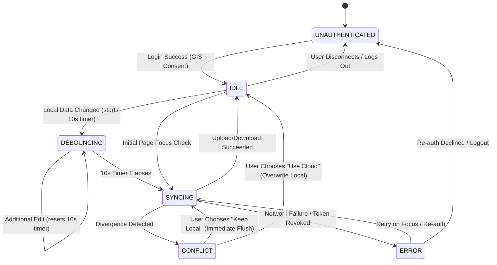

# Data Model: Google Drive Cloud Synchronization

**Feature**: Google Drive Cloud Synchronization  
**Branch**: `001-gdrive-cloud-sync`  
**Date**: 2026-09-05  
**Spec**: [spec.md](./spec.md)

This document specifies the core data structures, validation rules, and state machine transitions for the cloud synchronization system.

---

## 1. Entities & Data Schemas

### 1.1 CloudAccountSession
Represents the user's active Google authentication session and profile information.

```typescript
export interface CloudAccountSession {
  /** Unique Google user ID (subject) if available */
  sub?: string
  /** User's primary email address */
  email: string
  /** User's display name */
  name: string
  /** URL to user's profile avatar image */
  picture?: string
  /** OAuth 2.0 access token */
  accessToken: string
  /** Unix timestamp (ms) when access token expires */
  expiresAt: number
  /** Granted OAuth scopes */
  scope: string
}
```

**Validation Rules**:
- `accessToken` MUST NOT be empty.
- `expiresAt` MUST be a positive integer in milliseconds representing a future timestamp at issue time.
- `scope` MUST include `https://www.googleapis.com/auth/drive.appdata`.

---

### 1.2 UnifiedSyncPackage
The atomic container encapsulating all 4 database slots uploaded to or downloaded from Google Drive's `appDataFolder`.

```typescript
export interface UnifiedSlotEntry<SlotData = unknown> {
  /** Display label for the slot (e.g. "Main", "EU Alt") */
  name: string
  /** Unix timestamp (ms) of the latest modification to this slot */
  lastEdit: number
  /** Serialized database payload for this slot */
  data: SlotData
}

export interface UnifiedSyncPackage<SlotData = unknown> {
  /** Schema version for future migration support */
  version: 1
  /** Identifier of the originating frontend application (e.g., "genshin-optimizer") */
  appId: string
  /** Unix timestamp (ms) when this package was generated */
  createdAt: number
  /** Hash or fingerprint of the serialized payload for rapid change detection */
  contentHash: string
  /** The 4 database slots indexed 1 through 4 */
  slots: {
    1: UnifiedSlotEntry<SlotData>
    2: UnifiedSlotEntry<SlotData>
    3: UnifiedSlotEntry<SlotData>
    4: UnifiedSlotEntry<SlotData>
  }
}
```

**Validation Rules**:
- `version` MUST equal `1`.
- `slots` MUST contain exactly keys `1`, `2`, `3`, and `4`.
- Each slot entry MUST contain a non-empty `name` and valid `lastEdit` timestamp.
- For Genshin Optimizer, `data` MUST validate against the slot database structure (characters, weapons, artifacts, teams, builds).

---

### 1.3 SyncRuntimeState
Operational runtime state tracked in memory and persisted in `localStorage` metadata.

```typescript
export type SyncStatus =
  | 'UNAUTHENTICATED'  // No account connected
  | 'IDLE'             // Connected and in sync
  | 'DEBOUNCING'       // Local change registered, waiting 10s
  | 'SYNCING'          // Upload or download network request in flight
  | 'CONFLICT'         // Divergent state detected, awaiting user choice
  | 'ERROR'            // Network or authorization failure

export interface SyncRuntimeMetadata {
  /** Current synchronization state */
  status: SyncStatus
  /** Unix timestamp (ms) of last successful cloud synchronization */
  lastSyncTime: number | null
  /** Google Drive file ID of the remote file in appDataFolder */
  remoteFileId: string | null
  /** Remote modifiedTime string reported by Google Drive */
  remoteModifiedTime: string | null
  /** Last known remote content hash */
  lastRemoteHash: string | null
  /** Local modification flag: true if edits occurred since lastSyncTime */
  isLocalDirty: boolean
  /** Last error message if status === 'ERROR' */
  errorMessage: string | null
}
```

---

### 1.4 ConflictComparison
The structured data model passed to the Conflict Resolution dialog.

```typescript
export interface SlotSummary {
  name: string
  lastEdit: number
  characterCount: number
  artifactCount: number
  weaponCount: number
}

export interface SyncVersionDescriptor {
  timestamp: number
  byteSize: number
  slots: Record<1 | 2 | 3 | 4, SlotSummary>
}

export interface ConflictComparison {
  local: SyncVersionDescriptor
  cloud: SyncVersionDescriptor
  /** Flag indicating one version is significantly smaller than the other */
  hasSevereDisparity: boolean
  /** Human-readable explanation of the disparity warning */
  disparityWarningText?: string
}
```

**Disparity Calculation Rule**:
```typescript
function computeSevereDisparity(localBytes: number, cloudBytes: number): boolean {
  if (localBytes === 0 || cloudBytes === 0) return true
  const maxBytes = Math.max(localBytes, cloudBytes)
  const minBytes = Math.min(localBytes, cloudBytes)
  // Flag disparity if smaller version is less than 65% of larger version
  return (minBytes / maxBytes) < 0.65
}
```

---

## 2. State Machine Transitions



---

## 3. Storage Key Hierarchy

| Storage Location | Key Name | Content |
| :--- | :--- | :--- |
| **Browser `localStorage`** | `gdrive_auth_session` | Serialized `CloudAccountSession` |
| **Browser `localStorage`** | `gdrive_sync_metadata` | Serialized `SyncRuntimeMetadata` |
| **Google Drive `appDataFolder`** | `genshin_optimizer_sync.json` | Serialized `UnifiedSyncPackage` |
