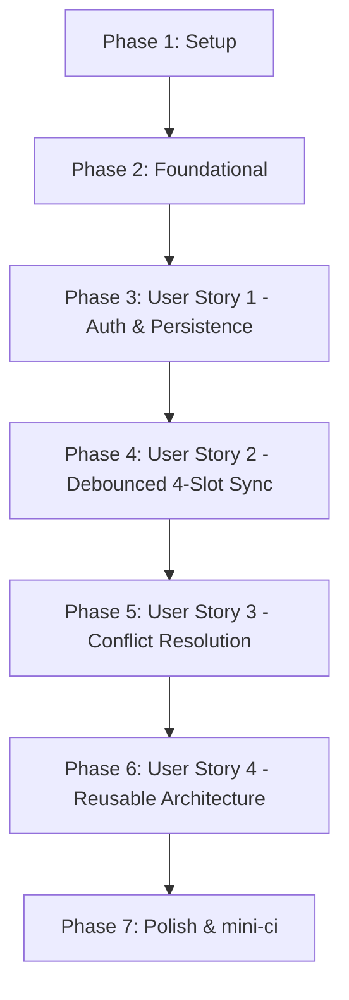

# Tasks: Google Drive Cloud Synchronization

**Feature**: Google Drive Cloud Synchronization  
**Branch**: `001-gdrive-cloud-sync`  
**Spec**: [spec.md](./spec.md) | **Plan**: [plan.md](./plan.md)

---

## Phase 1: Setup (Shared Infrastructure)

**Purpose**: Project initialization, dependency additions, and monorepo library structure

- [X] T001 Add `lodash.debounce` and `@types/lodash.debounce` dependencies in `package.json`
- [X] T002 [P] Create Nx library structure for `libs/common/gdrive` (`project.json`, `tsconfig.json`, `tsconfig.lib.json`, `tsconfig.spec.json`, `vitest.config.ts`)
- [X] T003 [P] Create Nx library structure for `libs/common/gdrive-ui` (`project.json`, `tsconfig.json`, `tsconfig.lib.json`, `tsconfig.spec.json`, `vitest.config.ts`)
- [X] T004 Register `@genshin-optimizer/common/gdrive` and `@genshin-optimizer/common/gdrive-ui` path mappings in `tsconfig.base.json`

---

## Phase 2: Foundational (Core Types, Schemas, & Data Contracts)

**Purpose**: Core data models, interfaces, and localization assets required before user stories can begin

**⚠️ CRITICAL**: Foundational tasks must be completed before implementing user stories

- [X] T005 [P] Implement core TypeScript data models and interfaces (`CloudAccountSession`, `UnifiedSyncPackage`, `SyncRuntimeMetadata`, `ConflictComparison`) in `libs/common/gdrive/src/types.ts`
- [X] T006 [P] Implement multi-slot adapter interface (`MultiSlotDataAdapter`) and contracts in `libs/common/gdrive/src/adapter.ts`
- [X] T007 [P] Add English localization strings for cloud sync, status messages, error alerts, and conflict dialog in `libs/gi/localization/assets/locales/en/settings.json`
- [X] T008 Export foundational types and interfaces from `libs/common/gdrive/src/index.ts`

**Checkpoint**: Foundation ready - user story implementation can now begin.

---

## Phase 3: User Story 1 - Connect Personal Cloud Storage via CloudSyncCard (Priority: P1) 🎯 MVP

**Goal**: Authenticate with Google Drive using Google Identity Services (GIS) with `drive.appdata` scope, persist session across browser refreshes, display user information on `CloudSyncCard`, and support sign-out.

**Independent Test**: Navigate to Settings page, click "Login with Google Drive" on `CloudSyncCard`, approve GIS consent popup, confirm user name/email and initial status display, refresh browser to verify persistent login without re-prompt, and test disconnecting the account.

### Tests for User Story 1
- [X] T009 [P] [US1] Create unit tests for Google Identity Services token client and persistence in `libs/common/gdrive/src/GoogleIdentityClient.test.ts`
- [X] T010 [P] [US1] Create unit tests for session persistence and authentication hook in `libs/common/gdrive-ui/src/hooks/useCloudAuth.test.ts`

### Implementation for User Story 1
- [X] T011 [US1] Implement Google Identity Services client (`init`, `requestLogin`, `silentRefresh`, `logout`) in `libs/common/gdrive/src/GoogleIdentityClient.ts`
- [X] T012 [US1] Implement React authentication hook (`useCloudAuth`) managing session state and GIS lifecycle in `libs/common/gdrive-ui/src/hooks/useCloudAuth.ts`
- [X] T013 [US1] Implement `CloudSyncCard` component displaying login prompt, user info, last sync time, and logout button in `libs/gi/page-settings/src/CloudSyncCard.tsx`
- [X] T014 [US1] Integrate `CloudSyncCard` into the settings page layout in `libs/gi/page-settings/src/index.tsx`
- [X] T015 [US1] Export authentication hooks and components from `libs/common/gdrive-ui/src/index.ts`

**Checkpoint**: User Story 1 (MVP) is fully functional and independently testable.

---

## Phase 4: User Story 2 - Automated Unified Multi-Slot Synchronization (Priority: P2)

**Goal**: Automatically synchronize all 4 database slots as a single atomic file in user's hidden `appDataFolder`, triggered on first window focus and 10s debounced local edits using `lodash.debounce`.

**Independent Test**: Modify character/artifact data across slots, verify that synchronization request fires exactly 10 seconds after the last edit, switch browser tab focus to verify focus trigger, and inspect the uploaded archive to confirm all 4 slots are persisted.

### Tests for User Story 2
- [X] T016 [P] [US2] Create unit tests for Google Drive REST API v3 client (`findFile`, `downloadFile`, `createFile`, `updateFile`) in `libs/common/gdrive/src/GoogleDriveApiClient.test.ts`
- [X] T017 [P] [US2] Create unit tests for debounced sync manager and focus listener using `lodash.debounce` in `libs/common/gdrive/src/CloudSyncManager.test.ts`
- [X] T018 [P] [US2] Create unit tests for Genshin multi-slot database packaging in `libs/gi/db-ui/src/gdrive/GenshinSlotAdapter.test.ts`

### Implementation for User Story 2
- [X] T019 [US2] Implement Google Drive REST API v3 client for `appDataFolder` in `libs/common/gdrive/src/GoogleDriveApiClient.ts`
- [X] T020 [US2] Implement `CloudSyncManager` with 10-second debounce, focus trigger, and state machine in `libs/common/gdrive/src/CloudSyncManager.ts`
- [X] T021 [US2] Implement `GenshinSlotAdapter` to serialize/deserialize all 4 `ArtCharDatabase` slots into `UnifiedSyncPackage` in `libs/gi/db-ui/src/gdrive/GenshinSlotAdapter.ts`
- [X] T022 [US2] Connect `CloudSyncManager` and `GenshinSlotAdapter` to `useCloudSync` hook in `libs/common/gdrive-ui/src/hooks/useCloudSync.ts`
- [X] T023 [US2] Update `CloudSyncCard` to display live sync state (Idle, Debouncing, Syncing, Error) and Last Sync timestamp in `libs/gi/page-settings/src/CloudSyncCard.tsx`

**Checkpoint**: User Stories 1 and 2 are functional and verifiable together.

---

## Phase 5: User Story 3 - Conflict Detection & Interactive Resolution (Priority: P3)

**Goal**: Detect divergent local vs. cloud edits, display `ConflictDialog` with size/timestamp comparison and severe disparity warning, immediately sync if user chooses "Keep Local Data", or overwrite local if user chooses "Use Cloud Data".

**Independent Test**: Simulate divergent edits between local slots and remote cloud file, trigger sync check, verify the Conflict Resolution dialog appears with side-by-side metrics and disparity warning, choose "Keep Local Data" to verify immediate upload without debounce delay, and choose "Use Cloud Data" to verify local database overwrite.

### Tests for User Story 3
- [X] T024 [P] [US3] Create unit tests for conflict detection and disparity warning calculations in `libs/common/gdrive/src/conflict.test.ts`
- [X] T025 [P] [US3] Create component tests for `ConflictDialog` in `libs/common/gdrive-ui/src/components/ConflictDialog.test.tsx`

### Implementation for User Story 3
- [X] T026 [US3] Implement conflict detection algorithm and disparity check heuristic in `libs/common/gdrive/src/conflict.ts`
- [X] T027 [US3] Implement `ConflictDialog` component with comparison matrix, warning alert, and resolution action buttons in `libs/common/gdrive-ui/src/components/ConflictDialog.tsx`
- [X] T028 [US3] Integrate conflict resolution handlers into `CloudSyncManager` (immediate flush for local choice, atomic overwrite for cloud choice) in `libs/common/gdrive/src/CloudSyncManager.ts`
- [X] T029 [US3] Integrate `ConflictDialog` modal into `CloudSyncCard` in `libs/gi/page-settings/src/CloudSyncCard.tsx`

**Checkpoint**: User Stories 1, 2, and 3 work seamlessly with full data safety protections.

---

## Phase 6: User Story 4 - Reusable Multi-Frontend Cloud Sync Architecture (Priority: P4)

**Goal**: Guarantee complete architectural decoupling of core sync libraries from Genshin domain models, allowing Star Rail (`sr-frontend`) or ZZZ (`zzz-frontend`) to integrate cloud sync solely via `MultiSlotDataAdapter`.

**Independent Test**: Validate that `libs/common/gdrive` and `libs/common/gdrive-ui` compile and pass tests with zero dependencies on `libs/gi/*` or `apps/frontend`.

### Implementation for User Story 4
- [X] T030 [P] [US4] Verify public library boundary exports and zero domain coupling in `libs/common/gdrive/src/index.ts`
- [X] T031 [P] [US4] Verify public UI library boundary exports and reusable components in `libs/common/gdrive-ui/src/index.ts`
- [X] T032 [US4] Document multi-frontend integration guide and generic slot adapter recipe in `libs/common/gdrive/README.md`

**Checkpoint**: Core synchronization platform is cleanly decoupled and reusable across frontends.

---

## Phase 7: Polish & Cross-Cutting Concerns

**Purpose**: Monorepo quality gates, verification, and end-to-end assurance

- [X] T033 [P] Run Biome formatting and linting across all affected libraries (`nx affected -t format`, `nx affected -t lint`)
- [X] T034 [P] Run TypeScript strict typecheck across all affected projects (`nx affected -t typecheck`)
- [X] T035 Run full unit test suite with coverage via Vitest (`CI=true nx affected -t test`)
- [X] T036 Validate quickstart scenarios and manual browser verification per `specs/001-gdrive-cloud-sync/quickstart.md`
- [X] T037 Execute `yarn run mini-ci` to verify all monorepo quality gates pass cleanly

---

## Dependencies & Execution Order

### Phase Dependencies

- **Setup (Phase 1)**: No dependencies — start immediately.
- **Foundational (Phase 2)**: Depends on Phase 1 completion — BLOCKS all user stories.
- **User Story 1 (Phase 3 - P1)**: Depends on Phase 2. Delivers the standalone MVP.
- **User Story 2 (Phase 4 - P2)**: Depends on Phase 3 (requires authenticated GIS token client).
- **User Story 3 (Phase 5 - P3)**: Depends on Phase 4 (requires working sync pipeline).
- **User Story 4 (Phase 6 - P4)**: Depends on Phase 5. Validates architectural reuse and documentation.
- **Polish (Phase 7)**: Depends on all user story implementations being complete.



---

## Parallel Execution Examples

### Parallel Example: Phase 1 (Setup)
```bash
# Initialize library structures concurrently:
Task: "T002 [P] Create Nx library structure for libs/common/gdrive"
Task: "T003 [P] Create Nx library structure for libs/common/gdrive-ui"
```

### Parallel Example: Phase 2 (Foundational)
```bash
# Implement types and i18n concurrently:
Task: "T005 [P] Implement core TypeScript data models in libs/common/gdrive/src/types.ts"
Task: "T006 [P] Implement multi-slot adapter interface in libs/common/gdrive/src/adapter.ts"
Task: "T007 [P] Add English localization strings in libs/gi/localization/assets/locales/en/settings.json"
```

### Parallel Example: User Story 1
```bash
# Author tests first in parallel:
Task: "T009 [P] [US1] Create unit tests in libs/common/gdrive/src/GoogleIdentityClient.test.ts"
Task: "T010 [P] [US1] Create unit tests in libs/common/gdrive-ui/src/hooks/useCloudAuth.test.ts"
```

### Parallel Example: User Story 2
```bash
# Author drive client and debounce tests in parallel:
Task: "T016 [P] [US2] Create unit tests in libs/common/gdrive/src/GoogleDriveApiClient.test.ts"
Task: "T017 [P] [US2] Create unit tests in libs/common/gdrive/src/CloudSyncManager.test.ts"
Task: "T018 [P] [US2] Create unit tests in libs/gi/db-ui/src/gdrive/GenshinSlotAdapter.test.ts"
```

---

## Implementation Strategy

### MVP First (User Story 1 Only)
1. Complete Phase 1 (Setup) and Phase 2 (Foundational).
2. Complete Phase 3 (User Story 1: Google Identity Services login, token persistence, and `CloudSyncCard`).
3. **Validate MVP**: User can log in with Google Drive from settings, see their profile and connection status, and retain connection upon refreshing the page.

### Incremental Delivery
1. **Increment 1 (MVP)**: Auth, persistence, and UI card (US1).
2. **Increment 2**: Automatic 10s debounced synchronization for all 4 slots and focus trigger (US2).
3. **Increment 3**: Conflict comparison dialog and severe disparity warning (US3).
4. **Increment 4**: Cross-frontend clean decoupling verification and integration guide (US4).
5. **Increment 5**: Full quality verification (`yarn run mini-ci`) (Polish).
