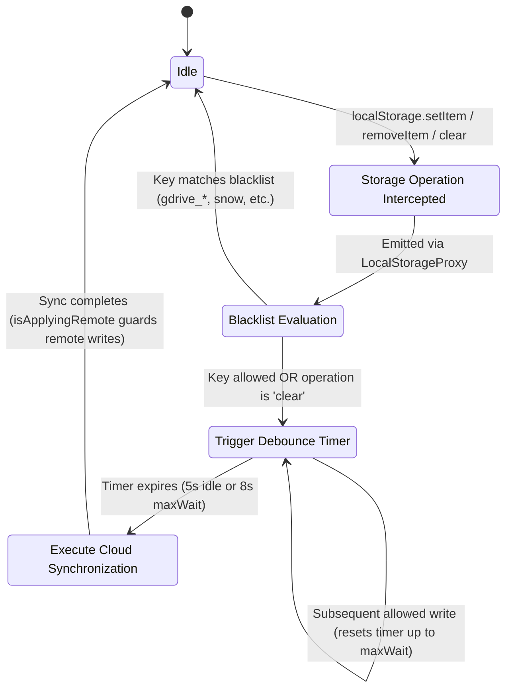
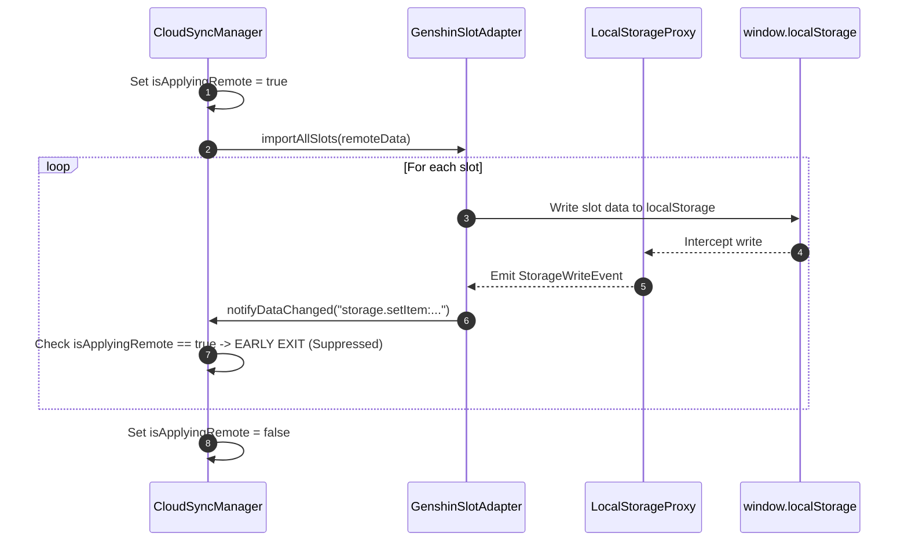

# Data Model: Storage Proxy Synchronization Trigger

**Feature**: Storage Proxy Synchronization Trigger  
**Branch**: `002-storage-proxy-sync-trigger`  
**Date**: 2026-09-10

---

## 1. Core Entities & Data Structures

### 1.1 StorageWriteEvent
Represents an intercepted persistent storage mutation intercepted by `LocalStorageProxy`.

| Field | Type | Description |
| :--- | :--- | :--- |
| `type` | `'setItem' \| 'removeItem' \| 'clear'` | The storage operation invoked. |
| `key` | `string \| undefined` | Target storage key. Present for `setItem` and `removeItem`; `undefined` for `clear`. |
| `value` | `string \| undefined` | Stored string value. Present for `setItem`; `undefined` for `removeItem` and `clear`. |
| `source` | `'method' \| 'property'` | Whether the write occurred via method (`localStorage.setItem(...)`) or property assignment (`localStorage.myKey = ...`). |

**Validation Rules**:
- When `type === 'setItem'`, `key` MUST be a non-empty string and `value` MUST be defined as a string.
- When `type === 'removeItem'`, `key` MUST be a non-empty string.
- When `type === 'clear'`, `key` and `value` MUST be undefined.

---

### 1.2 StorageKeyBlacklist
Defines the exclusion criteria used to suppress recursive sync loops and ignore non-database persistent settings.

| Field | Type | Description |
| :--- | :--- | :--- |
| `exactKeys` | `ReadonlySet<string>` | Set of literal storage keys that must never trigger cloud synchronization. |
| `prefixPatterns` | `readonly string[]` | Array of key prefix strings. Any storage key starting with any of these prefixes is ignored. |

**Default Configurations**:
- `exactKeys`: `Set(['snow', 'silly', 'newTabKey'])`
- `prefixPatterns`: `['gdrive_', 'infoShown_']`

**Matching Algorithm**:
```typescript
function isKeyBlacklisted(key: string, blacklist: StorageKeyBlacklist): boolean {
  if (blacklist.exactKeys.has(key)) return true
  for (const prefix of blacklist.prefixPatterns) {
    if (key.startsWith(prefix)) return true
  }
  return false
}
```

---

### 1.3 TriggerDecision
The evaluation output determined for each incoming `StorageWriteEvent`.

| Decision State | Condition | Consequence |
| :--- | :--- | :--- |
| **IGNORE_BLACKISTED** | `event.type !== 'clear'` AND `isKeyBlacklisted(event.key)` | Event discarded immediately. No listeners notified; sync state unchanged. |
| **TRIGGER_CLEAR** | `event.type === 'clear'` | Unconditionally passes filter; invokes active listeners with reason `'storage.clear'`. |
| **TRIGGER_MUTATION** | `event.type !== 'clear'` AND `!isKeyBlacklisted(event.key)` | Passes filter; invokes active listeners with reason `'storage.${type}:${key}'`. |

---

## 2. Synchronization Trigger Lifecycle & State Transitions

The diagram below illustrates the event flow from storage write to sync trigger:



---

## 3. Remote Import Echo Suppression

To prevent cloud data downloads from triggering re-upload cycles:



- When `CloudSyncManager` imports cloud data into local slots, `isApplyingRemote` is set to `true`.
- Any storage write events triggered during this window are discarded by `CloudSyncManager.notifyDataChanged()`.
