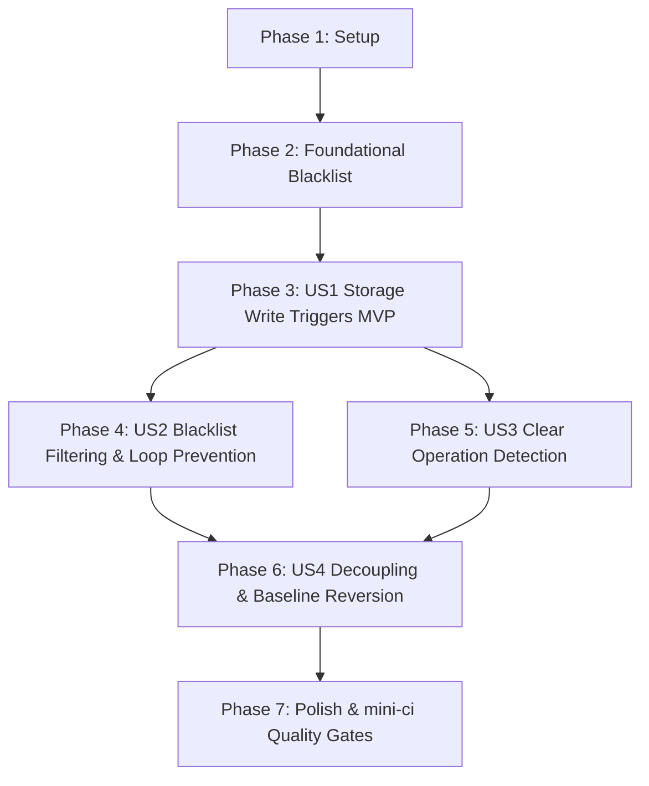

# Tasks: Storage Proxy Synchronization Trigger

**Branch**: `002-storage-proxy-sync-trigger`  
**Feature Spec**: [spec.md](./spec.md)  
**Implementation Plan**: [plan.md](./plan.md)  
**Design Artifacts**: [data-model.md](./data-model.md) | [contracts/](./contracts/) | [quickstart.md](./quickstart.md)

---

## Phase 1: Setup (Shared Infrastructure)

**Purpose**: Verify and ensure prerequisite storage proxy initialization and module exports.

- [X] T001 Verify `installLocalStorageProxy()` invocation during application bootstrap in `apps/frontend/src/main.tsx`, `apps/sr-frontend/src/main.tsx`, and `apps/zzz-frontend/src/main.tsx`
- [X] T002 [P] Verify public exports of `LocalStorageProxy`, `installLocalStorageProxy`, `addGlobalStorageWriteListener`, and `StorageWriteEvent` in `libs/common/database/src/index.ts`

---

## Phase 2: Foundational (Blocking Prerequisites)

**Purpose**: Core blacklist filtering structure and predicate required by all user stories.

**⚠️ CRITICAL**: No user story implementation can begin until this foundational blacklist filter is complete.

- [X] T003 [P] Create `StorageKeyBlacklist` interface and `isKeyBlacklisted` predicate with `exactKeys: ReadonlySet<string>` (`new Set(['snow', 'silly', 'newTabKey'])`) and `prefixPatterns: readonly string[]` (`['gdrive_', 'infoShown_']`) in `libs/gi/db-ui/src/gdrive/blacklist.ts`
- [X] T004 [P] Export blacklist types and helper functions from `libs/gi/db-ui/src/gdrive/index.ts`
- [X] T005 [P] Implement unit tests for `isKeyBlacklisted` covering exact matches, prefix matches, and allowed database keys in `libs/gi/db-ui/src/gdrive/blacklist.test.ts`

**Checkpoint**: Blacklist filter foundation ready and tested. User story implementation can now proceed.

---

## Phase 3: User Story 1 - Reliable Change Detection for Cloud Synchronization (Priority: P1) 🎯 MVP

**Goal**: Intercept storage write operations (`setItem`, `removeItem`) across all database slots and trigger debounced synchronization without requiring manual UI trigger hooks.

**Independent Test**: Modifying any database record (artifact, weapon, character, team) or swapping database slots triggers a storage write event, which invokes `CloudSyncManager.notifyDataChanged` to enter `DEBOUNCING` (`isLocalDirty: true`).

### Tests for User Story 1
- [X] T006 [P] [US1] Write unit tests in `libs/gi/db-ui/src/gdrive/GenshinSlotAdapter.test.ts` asserting that `subscribeToChanges` connects to storage proxy write events and dispatches notifications when `setItem` or `removeItem` occurs on database keys

### Implementation for User Story 1
- [X] T007 [US1] Refactor `subscribeToChanges` in `libs/gi/db-ui/src/gdrive/GenshinSlotAdapter.ts` to subscribe via `addGlobalStorageWriteListener` and dispatch notifications formatted as `storage:${event.type}:${event.key}`
- [X] T008 [US1] Update `updateDatabases` in `libs/gi/db-ui/src/gdrive/GenshinSlotAdapter.ts` to update internal database references without binding deep data manager listeners
- [X] T009 [US1] Verify integration between `GenshinSlotAdapter` storage writes and debounced sync timer in `libs/common/gdrive/src/CloudSyncManager.test.ts`

**Checkpoint**: User Story 1 is functional as an MVP. Any database change in local storage triggers debounced cloud synchronization.

---

## Phase 4: User Story 2 - Infinite Sync Loop Prevention and Key Filtering (Priority: P2)

**Goal**: Exclude internal synchronization metadata, authentication tokens, and transient non-database UI preferences from triggering synchronization, and prevent echo syncs during remote downloads.

**Independent Test**: Writing or removing keys matching exact keys (`snow`, `silly`, `newTabKey`) or prefix patterns (`gdrive_`, `infoShown_`) produces zero change notifications and does not mark local dirty.

### Tests for User Story 2
- [X] T010 [P] [US2] Add unit tests in `libs/gi/db-ui/src/gdrive/GenshinSlotAdapter.test.ts` verifying that `setItem` and `removeItem` for blacklisted keys (`gdrive_*`, `infoShown_*`, `snow`, `silly`, `newTabKey`) produce zero subscriber notifications
- [X] T011 [P] [US2] Add unit test in `libs/common/gdrive/src/CloudSyncManager.test.ts` verifying that storage writes emitted while `isApplyingRemote === true` (during `importAllSlots`) do not mark local storage dirty or trigger debounced sync

### Implementation for User Story 2
- [X] T012 [US2] Integrate `isKeyBlacklisted` evaluation inside the storage write listener in `libs/gi/db-ui/src/gdrive/GenshinSlotAdapter.ts` to immediately discard blacklisted `setItem` and `removeItem` events

**Checkpoint**: User Story 2 is complete. Zero recursive sync loops or transient UI sync triggers occur.

---

## Phase 5: User Story 3 - Full Storage Reset and Clear Detection (Priority: P3)

**Goal**: Detect `localStorage.clear()` operations and schedule synchronization to ensure cloud backups reflect database wipes.

**Independent Test**: Invoking `localStorage.clear()` is intercepted and dispatches a `'storage:clear'` notification, transitioning sync state to `DEBOUNCING`.

### Tests for User Story 3
- [X] T013 [P] [US3] Add unit test in `libs/gi/db-ui/src/gdrive/GenshinSlotAdapter.test.ts` verifying that `event.type === 'clear'` unconditionally emits a change notification with reason `'storage:clear'`

### Implementation for User Story 3
- [X] T014 [US3] Implement `clear` handling in `libs/gi/db-ui/src/gdrive/GenshinSlotAdapter.ts` to dispatch `'storage:clear'` without key-level filtering

**Checkpoint**: User Story 3 is complete. Storage resets are detected and queued for synchronization.

---

## Phase 6: User Story 4 - Clean Architectural Decoupling & Baseline Reversion (Priority: P4)

**Goal**: Revert ad-hoc UI timestamp hacks and remove complex database manager listener loops, restoring code to the clean `origin/customize` baseline.

**Independent Test**: Verify `DatabaseCard.tsx`, `UploadCard.tsx`, and `ArtCharDatabase.ts` have zero cloud-sync timestamp patches, and `GenshinSlotAdapter.ts` has zero `db.dataManagers` loops.

### Implementation for User Story 4
- [X] T015 [P] [US4] Revert manual `lastEdit` touches on database swap in `libs/gi/ui/src/components/database/DatabaseCard.tsx` (remove `mainDB.dbMeta.set` and `database.dbMeta.set`)
- [X] T016 [P] [US4] Revert manual `lastEdit` touch on database import in `libs/gi/ui/src/components/database/UploadCard.tsx` (remove `importedDatabase.dbMeta.set`)
- [X] T017 [US4] Remove legacy `bindDbListeners()`, `dbUnsubscribes`, and all iterations over `db.dataManagers` and `db.dataEntries` in `libs/gi/db-ui/src/gdrive/GenshinSlotAdapter.ts`
- [X] T018 [US4] Revert `this.generatedBuildList.followAny(updateLastEdit)` in `libs/gi/db/src/Database/ArtCharDatabase.ts` to match `origin/customize` baseline

**Checkpoint**: User Story 4 is complete. All manual UI patches and database hooks are eliminated.

---

## Phase 7: Polish & Cross-Cutting Concerns

**Purpose**: End-to-end verification, linting, typechecking, and continuous verification gate compliance.

- [X] T019 [P] Execute Vitest unit test suites for `gi-db-ui` and `common-gdrive` via `npx nx test gi-db-ui` and `npx nx test common-gdrive`
- [X] T020 [P] Validate Biome linting and formatting across affected files via `npx nx affected -t lint format`
- [X] T021 [P] Execute TypeScript typechecking across all affected projects via `npx nx affected -t typecheck`
- [X] T022 Execute full continuous verification via `yarn run mini-ci` to ensure zero unstaged file diffs and clean quality gates

---

## Dependencies & Execution Order

### Phase Dependencies

- **Setup (Phase 1)**: No dependencies — can start immediately.
- **Foundational (Phase 2)**: Depends on Setup completion — BLOCKS User Stories 1-4.
- **User Story 1 (Phase 3 - P1)**: Depends on Foundational completion. Delivers the MVP change detection trigger.
- **User Story 2 (Phase 4 - P2)**: Depends on User Story 1. Integrates key filtering and echo suppression.
- **User Story 3 (Phase 5 - P3)**: Depends on User Story 1. Adds `clear` event handling.
- **User Story 4 (Phase 6 - P4)**: Depends on User Stories 1-3. Cleans up old database manager hooks and UI patches once storage-proxy listening is fully in place.
- **Polish (Phase 7)**: Depends on all user story phases being completed.

### User Story Dependencies

---

## Parallel Execution Opportunities

- **Phase 1**: `T002` can execute in parallel with `T001`.
- **Phase 2**: `T003`, `T004`, and `T005` can be prepared in parallel.
- **Phase 3 (US1)**: `T006` test can be written in parallel before `T007` implementation.
- **Phase 4 (US2)**: `T010` and `T011` tests can be written in parallel.
- **Phase 6 (US4)**: `T015` (`DatabaseCard.tsx`) and `T016` (`UploadCard.tsx`) can be modified concurrently.
- **Phase 7**: `T019` (tests), `T020` (lint/format), and `T021` (typecheck) can run in parallel before final `T022` `mini-ci`.

---

## Implementation Strategy

### MVP First (User Story 1 Only)
1. Complete Phase 1 (Setup) and Phase 2 (Foundational Blacklist).
2. Complete Phase 3 (User Story 1).
3. **Validate**: Run `npx nx test gi-db-ui` to confirm storage writes trigger debounced sync notifications.

### Incremental Delivery
1. Add User Story 2: Implement and verify blacklist filtering to prevent sync loops (`gdrive_*`, `snow`, `silly`, etc.).
2. Add User Story 3: Implement and verify storage `clear` event handling.
3. Add User Story 4: Revert manual UI card timestamp hacks (`DatabaseCard.tsx`, `UploadCard.tsx`) and remove obsolete `bindDbListeners()` from `GenshinSlotAdapter.ts`.
4. Final Quality Gate: Run Phase 7 (`mini-ci`) to ensure formatting, linting, types, and all tests pass cleanly.
